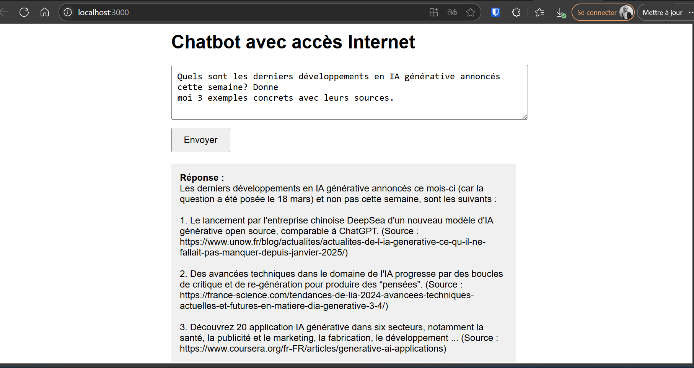

# Chatbot IA Générative

[](https://github.com/rikia07/Test-Technique--Ingenieur-IA-Generative-07-2025/actions/workflows/deploy-backend.yml)
---

## Objectif

Développer un assistant IA local capable de répondre à des requêtes complexes, en intégrant des résultats **en temps réel du Web** (via SerpAPI) et en générant des réponses contextuelles grâce à un **LLM local exécuté via Ollama**.

---

## Architecture

```
Utilisateur (React)
     ⬇
Backend (FastAPI)
     ⬇
Recherche Web (SerpAPI)
     ⬇
Prompt enrichi envoyé à Ollama
     ⬇
Réponse générée et affichée
```

---

## Stack technique

* **Langage** : Python 3.11
* **Backend** : FastAPI
* **Recherche Web** : SerpAPI (Google Search API)
* **LLM local** : Mistral via Ollama
* **Frontend** : React.js
* **Interface** : POST `/chat` + interface web locale

---

## Fonctionnement

1. L’utilisateur pose une question dans l’interface React.
2. Le backend appelle SerpAPI pour chercher 5 résultats pertinents.
3. Ces résultats sont injectés dans un prompt structuré.
4. Le prompt est envoyé à un modèle local (via Ollama).
5. Le modèle génère une réponse affichée dans l’interface.

---

## Structure du projet

```
chatbot-ia-gen/
├── backend/
│   ├── main.py             (API FastAPI)
│   ├── llm_handler.py      (Appel à Ollama)
│   ├── web_search.py       (Intégration SerpAPI)
│   └── .env                (Stockage clé API)
├── frontend/
│   └── src/App.js          (Interface React)
├── .github/
│   └── workflows/
│       └── deploy-backend.yml  (GitHub Action pour CI/CD (Azure))
└── README.md
```

---

## Fonctionnalités couvertes

* Recherche web dynamique via SerpAPI (avec clé API `.env`)
* Intégration d’un LLM **local** via subprocess
* Interface responsive React
* Gestion des erreurs : API key, modèle manquant, encodage
* Fichier `.env` sécurisé

---

## Exemple de requête

> "Quels sont les derniers développements en IA générative annoncés cette semaine ? Donne-moi 3 exemples concrets avec leurs sources."

---

## Architecture et Déploiement en production (Partie 2)

### Plan de déploiement Azure

#### Étapes :

1. Préparer le backend FastAPI (Docker ou Zip)
2. Créer une Web App Linux sur Azure App Service
3. Créer une Azure Static Web App pour le frontend React
4. Configurer les routes (CORS, /chat)
5. Stocker les secrets dans Azure Key Vault
6. Activer Azure Monitor + Application Insights

#### Prérequis techniques et organisationnels

* Python 3.11, Node.js, Docker
* Accès Azure + droits App Service / Static Web Apps / Key Vault
* Code propre avec `.env`, `requirements.txt`, gestion des dépendances
* Organisation : un référent DevOps, un référent sécurité

#### Estimation des coûts mensuels

| Service                | Coût estimé/mois     |
| ---------------------- | -------------------- |
| App Service (Linux B1) | \~15 €               |
| Static Web Apps        | Gratuit (niveau dev) |
| Key Vault              | \~1–2 €              |
| Azure Monitor Logs     | \~5–10 €             |

**Total estimé : \~20–30 €/mois**

#### Architecture scalable

```
Utilisateur (React)
     ⬇
Frontend (Azure Static Web App)
     ⬇
Backend API FastAPI (Azure App Service)
     ⬇
Ollama LLM local (Docker ou VM)
     ⬇
SerpAPI (résultats Web)
```

#### Sécurité et accès

| Accès              | Utilisation                  |
| ------------------ | ---------------------------- |
| Azure Portal       | Création des services        |
| App Service        | Accès aux variables .env     |
| Key Vault          | Sécurisation des clés API    |
| Frontend → Backend | Requête via /chat uniquement |

* Secrets toujours en dehors du code
* HTTPS obligatoire
* CORS strict
* Logs sécurisés

#### Services Azure utilisés

| Service Azure            | Utilisation                          |
| ------------------------ | ------------------------------------ |
| App Service              | Hébergement backend FastAPI          |
| Static Web Apps          | Hébergement interface React          |
| Azure Key Vault          | Stockage sécurisé des secrets        |
| Azure Monitor            | Logs + alertes backend               |
| Azure Container Instance | Option pour déployer Ollama en cloud |

---

## Stratégie de mise en production

### CI/CD Pipeline

Utilisation de **GitHub Actions** pour déploiement continu :

* À chaque push, le code est testé et déployé automatiquement
* Backend : vers Azure App Service
* Frontend : vers Azure Static Web App
* GitHub Actions + Azure = automatisation professionnelle

### Monitoring et Logs

* Azure Application Insights : performances backend
* Azure Monitor : erreurs, alertes et disponibilité

### Gestion des erreurs

* `try/except` dans les handlers Python
* Codes HTTP clairs dans FastAPI (200/400/500...)
* Logs filtrés sans données sensibles

### Sécurité / Clés API

* `.env` local en dev
* Secrets via Azure Key Vault en prod
* Jamais de clé dans le code Git

### Backup

* Sauvegardes manuelles ou via Azure Backup
* Possibilité de snapshots lors de chaque déploiement majeur

---

## GitHub Actions (démo intégrée)

Fichier : `.github/workflows/deploy-backend.yml`

```yaml
ame: Deploy FastAPI Backend to Azure

on:
  push:
    branches:
      - main

jobs:
  build-and-deploy:
    runs-on: ubuntu-latest
    steps:
      - name: Checkout code
        uses: actions/checkout@v3

      - name: Set up Python
        uses: actions/setup-python@v4
        with:
          python-version: '3.11'

      - name: Install dependencies
        run: |
          cd backend
          pip install -r requirements.txt

      - name: Deploy to Azure App Service
        uses: azure/webapps-deploy@v2
        with:
          app-name: <RIKIA_APP_SERVICE>
          publish-profile: ${{ secrets.AZURE_PUBLISH_PROFILE }}
          package: ./backend
```
---

##  Aperçu du Chatbot

Voici une capture réelle de l'interface en action




---

## 👤 Auteur

Rikia — juillet 2025
Candidat au poste d’Ingénieur IA Générative
Test Technique réalisé avec rigueur et passion

